# 现网导航查缺补漏 — 测试验收报告

| 项   | 内容                                                   |
| --- | ---------------------------------------------------- |
| 产品  | 健忻医疗项目管理系统（禅道开源 22.5 + Jenshin 定制）                   |
| 范围  | 工作台 / 产品组合 / 项目 / 阶段任务 / 数据看板 / 组织权限；不打开注册 / 准入 / 入院 |
| 环境  | `http://127.0.0.1:8080`，账号 `admin` / `qa_nostory`，视口 1440×900 |
| 日期  | 2026-09-04；残留收口 2026-09-05                               |
| 数据  | 产品 22「QA验收档案-20260904」、阶段 36、任务 78 / 68              |
| 结论  | **32 / 32 通过**；原残留 1–4 已收口；阶段「关联计划」按范围不回加           |

---

## 1. 一级导航与项目列表

**预期：** 左侧只有工作台、产品组合、项目管理、阶段任务、数据看板、文档空间、组织部门、组织设置；无注册 / 准入 / 入院；「创建项目」直达 scrum 表单。

**结果：** 通过。导航 8 项齐全，无医疗事项菜单；「创建项目」链接为 `/project-create-scrum-0.html`。

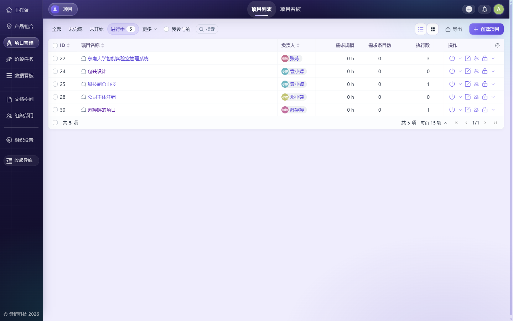

---

## 2. 工作台欢迎区

**预期：** 「需关注」为待办日程 / 待处理任务 / 逾期项目 / 风险项目（看板口径，不再写「阻塞项目」）。

**结果：** 通过。当日读数：待办日程 0、待处理任务 1、逾期项目 0、风险项目 1。数字可点击。

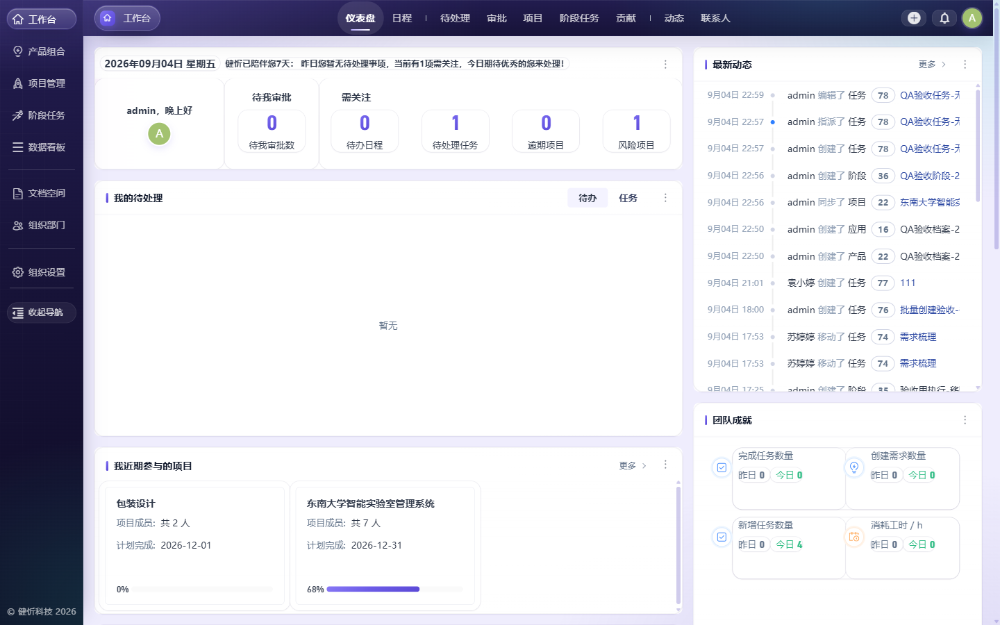

---

## 3. 待处理任务跳转

**预期：** 欢迎区「待处理任务」跳到指派给我的任务；列表无「相关需求」列。

**结果：** 通过。跳转到 `/my-work-task-assignedTo.html`，列名为 ID / 任务名称 / P / 状态 / 所属项目 / 所属阶段任务 / 创建者 / 操作。任务 78 在列。页签仍有「需求 0」（禅道「我的需求」入口，不是任务列）。

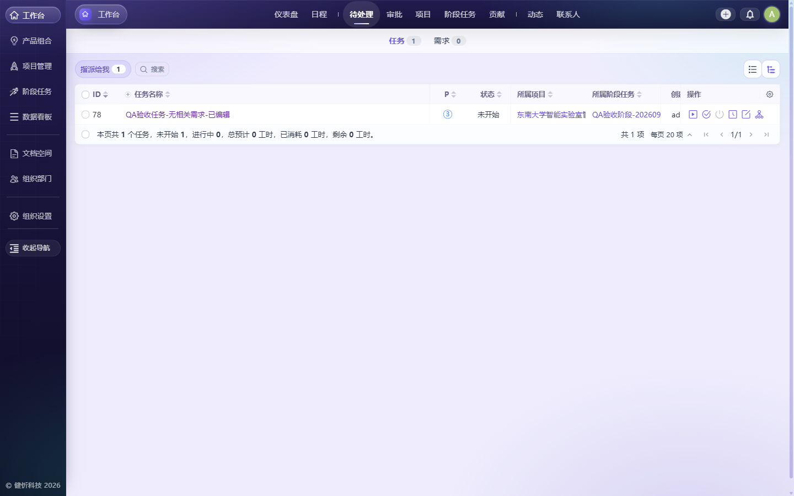

---

## 4. 审批过滤

**预期：** 审批页不再出现「用例」筛选。

**结果：** 通过。仅「全部 0」，文案无「用例」。

---

## 5. 产品列表档案列

**预期：** 列表含型号、管理类别、注册证号、证照有效期；90 天内显示「临期」。

**结果：** 通过。多条产品有证号与日期；`JX-WS80`、`JX-BB18`、产品 22（2026-10-15）带「临期」。

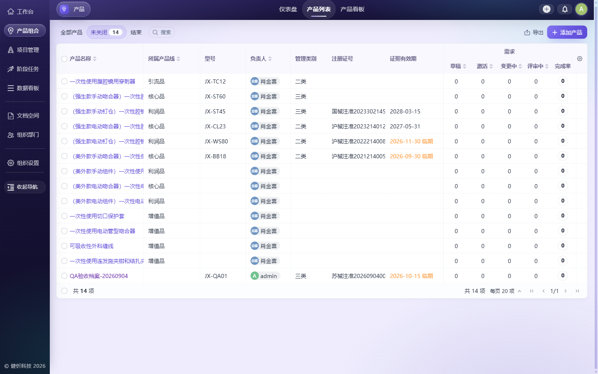

---

## 6. 产品详情顶栏

**预期：** 二级菜单保留仪表盘 / 项目 / 文档 / 设置；无需求、计划、发布、路线图、矩阵。

**结果：** 通过。顶栏为仪表盘、项目、文档、动态、设置。无需求 / 计划 / 发布 / 路线图 / 矩阵。产品列表名称落到仪表盘，不再进需求列表。

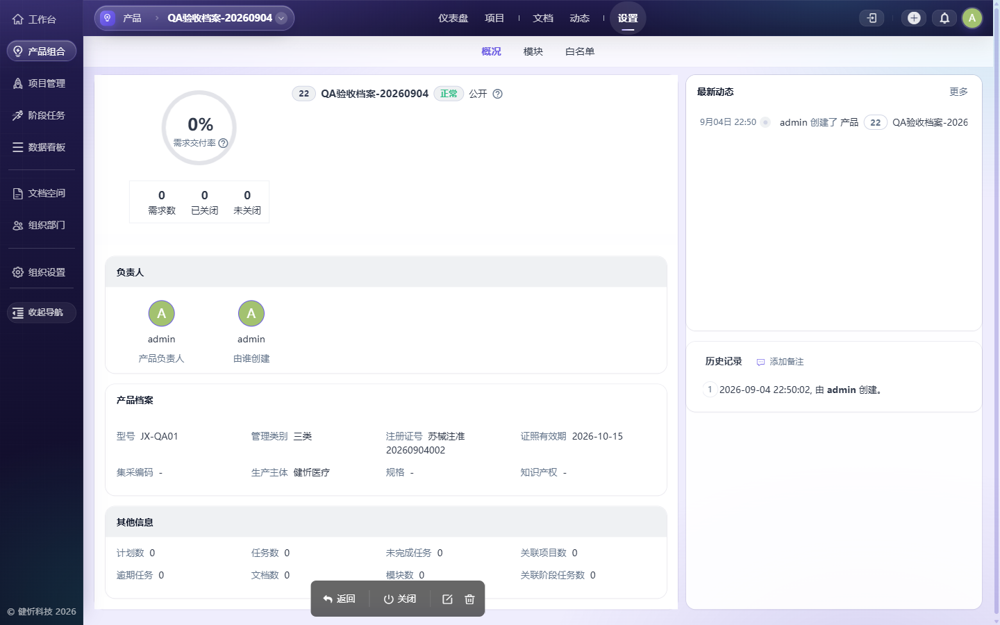

---

## 7. 产品档案面板

**预期：** 无档案行也渲染面板；已填字段展示，空值为 `-`。

**结果：** 通过。产品 22：型号 `JX-QA01`、三类、`苏械注准20260904002`、有效期 2026-10-15、生产主体「健忻医疗」；集采编码 / 规格 / 知识产权为 `-`。

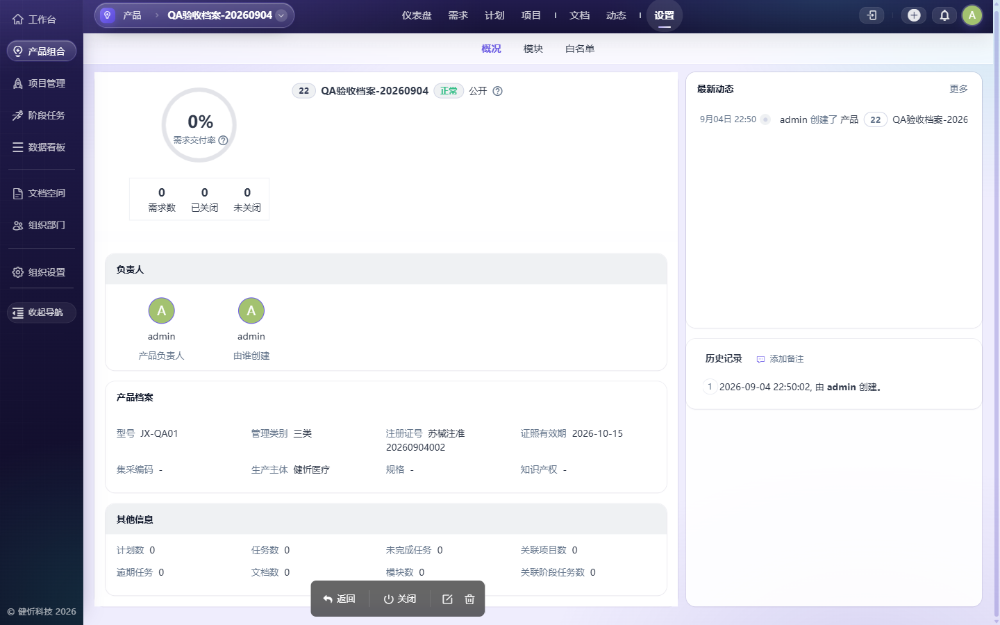

---

## 8. 产品编辑预填

**预期：** 编辑页档案字段预填，可保存。

**结果：** 通过。表单字段与详情一致（型号、三类、证号、2026-10-15、健忻医疗）。

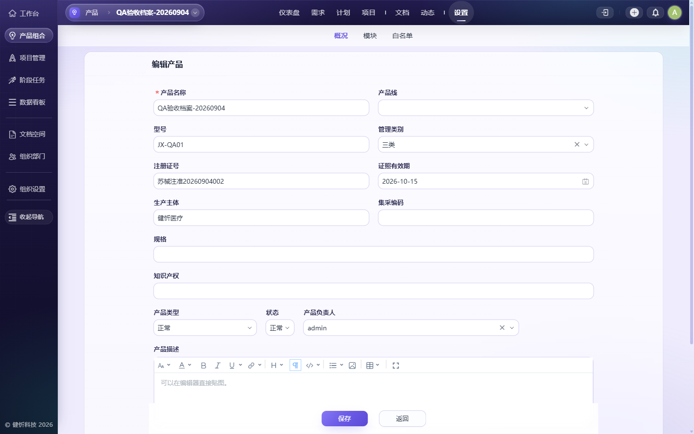

---

## 9. 批量编辑档案列

**预期：** 列表勾选后「编辑」进入批量页，含管理类别 / 注册证号 / 证照有效期。

**结果：** 通过。勾选 14 项后进入批量编辑；表头含上述三列，产品 22 预填三类 / `苏械注准20260904002` / `2026-10-15`。截图为向右滚动后的档案列区域。

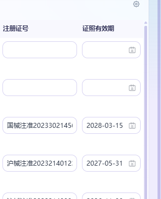

---

## 10. 阶段创建

**预期：** 创建阶段无 PO / QD / PM / RD。

**结果：** 通过。项目 22 下「添加阶段」无上述角色。「关联计划」仍在（计划范围内保留）。

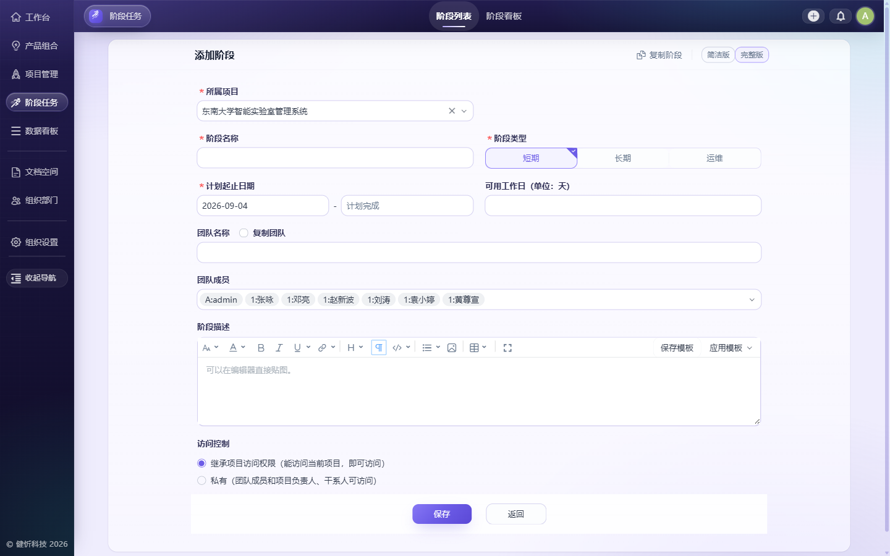

---

## 11. 综合看板泳道

**预期：** 阶段综合看板无 Bug 泳道。

**结果：** 通过。阶段 36 综合看板为父需求 / 需求 / 任务，无 Bug 泳道。

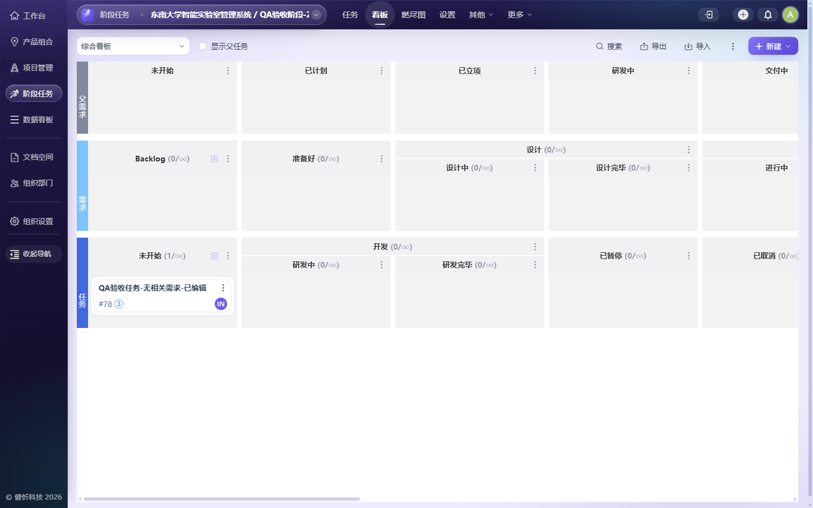

---

## 12. 看板「新建」菜单

**预期：** 新建下拉有提需求 / 建任务，无提 Bug。

**结果：** 通过。菜单为提需求、批量新建需求、建任务、批量建任务。DOM 中仍有隐藏的「批量提 Bug」，不在新建下拉。

---

## 13. 建任务表单

**预期：** 创建任务无「相关需求」字段，默认 story=0。

**结果：** 通过。阶段 36 建任务表单无该字段。

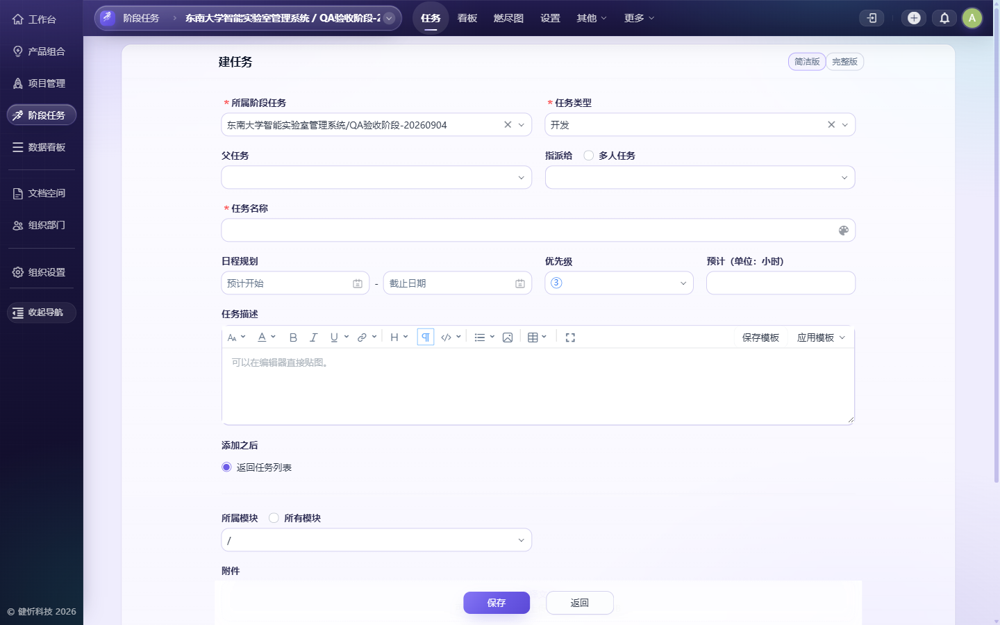

---

## 14. 任务详情

**预期：** 任务详情基本信息无「相关需求」。

**结果：** 通过。任务 78「QA验收任务-无相关需求-已编辑」基本信息为阶段、模块、指派、类型、状态、进度、优先级等，无相关需求字段。

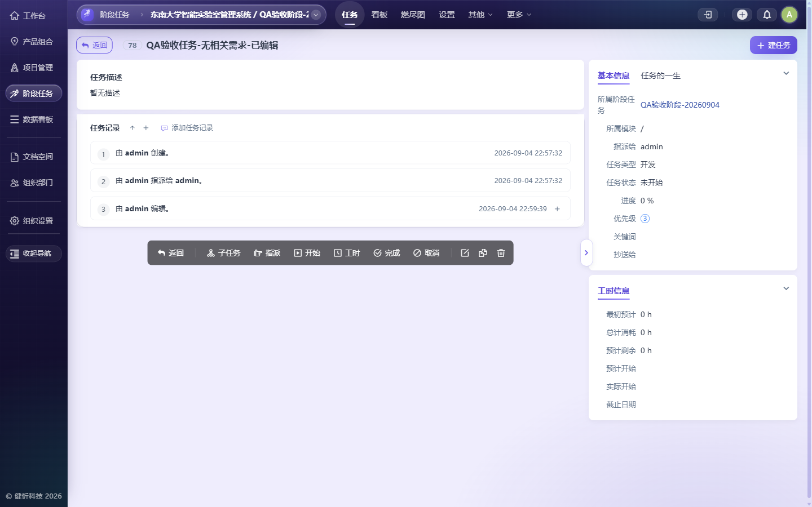

---

## 15. 阶段概况

**预期：** 阶段概况有「逾期任务」统计。

**结果：** 通过。阶段 36 顶栏：总进度 / 需求 / 任务 / **逾期任务 0**。二级菜单无测试、构建。

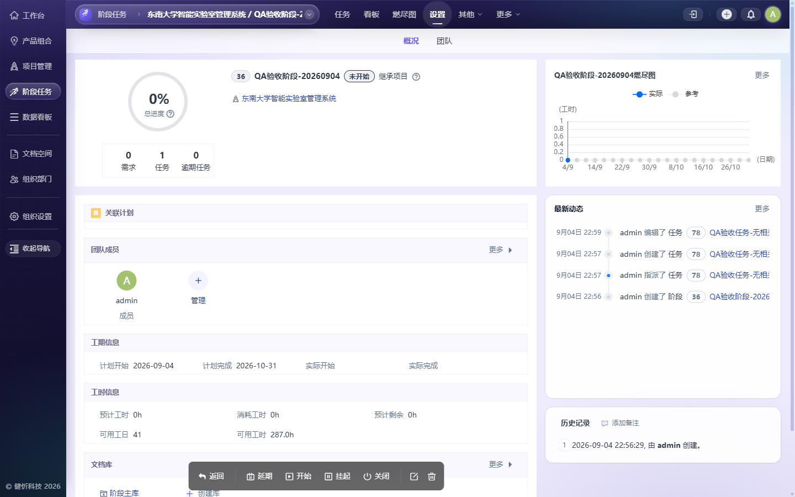

---

## 16. 创建项目

**预期：** 「创建项目」直接 scrum 表单，无模型向导。

**结果：** 通过。URL `/project-create-scrum-0.html`，直接进入产品型 / 项目型表单。

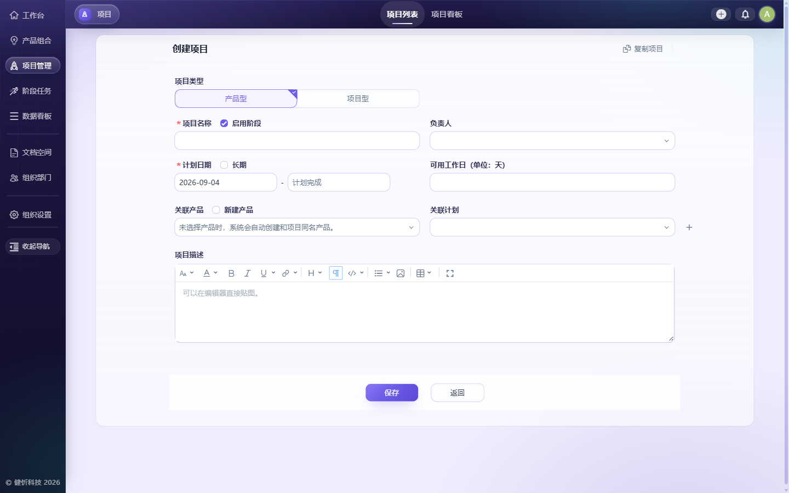

---

## 17. 数据看板总览

**预期：** KPI + 四视图导航（经营总览 / 部门经营 / 项目组合 / 会议视图）。

**结果：** 通过。项目总数 8、正常 7、风险 1、逾期任务 4；四视图导航齐全。

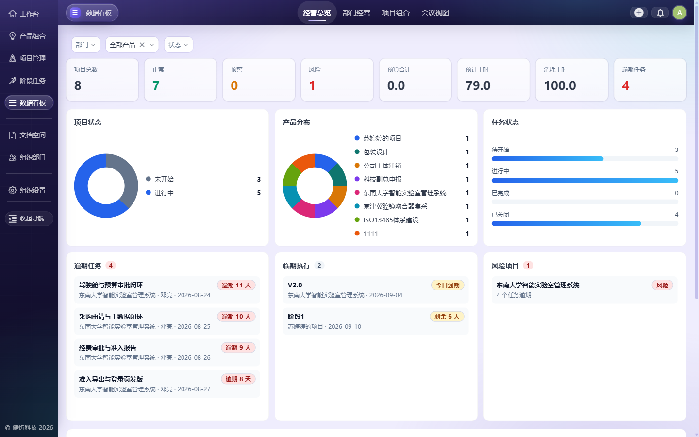

---

## 18. 逾期 / 临期列表

**预期：** 总览展示逾期任务与临期执行，条目可点。

**结果：** 通过。4 条逾期任务、2 条临期执行（含「今日到期」）。

---

## 19. 部门经营

**预期：** 按部门汇总项目数、工时、逾期、风险。

**结果：** 通过。财务部 / 运营部 / 信息部 / 招投标部 / 质量部；信息部 4 逾期、1 风险。

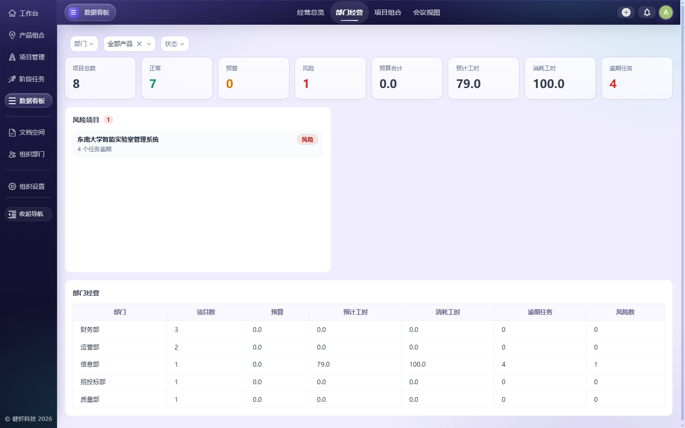

---

## 20. 项目组合

**预期：** 组合表含健康度列。

**结果：** 通过。健康度有「正常」「风险」；东南大学智能实验室管理系统为风险。

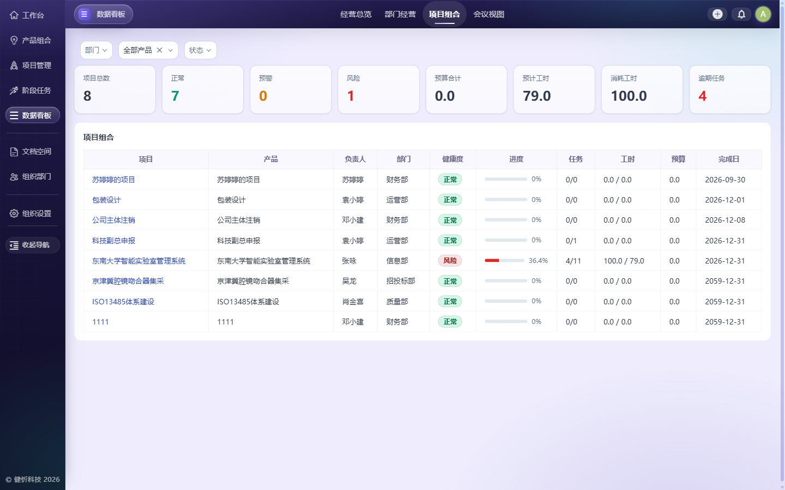

---

## 21. 会议视图

**预期：** 会议视图同时列出逾期任务与临期执行。

**结果：** 通过。逾期 4 条、临期执行 2 条。

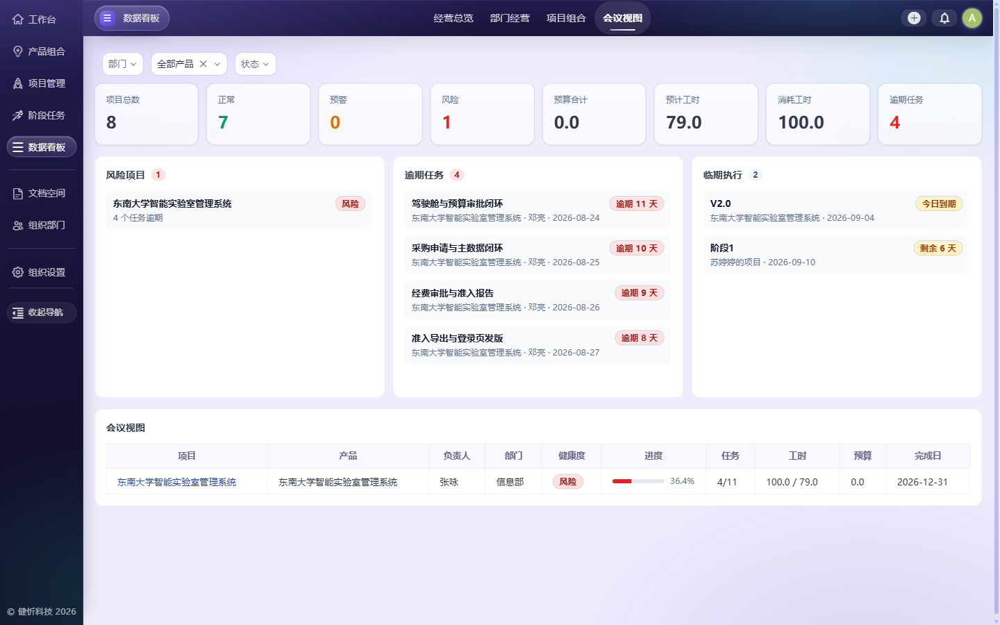

---

## 22. 看板空筛选

**预期：** 筛产品 22（无关联项目）给出空态和「清除筛选」。

**结果：** 通过。文案：「当前筛选没有项目」「没有匹配的项目。请更换部门、产品或状态，或清除筛选后再看。」产品下拉为「QA验收档案-20260904」。

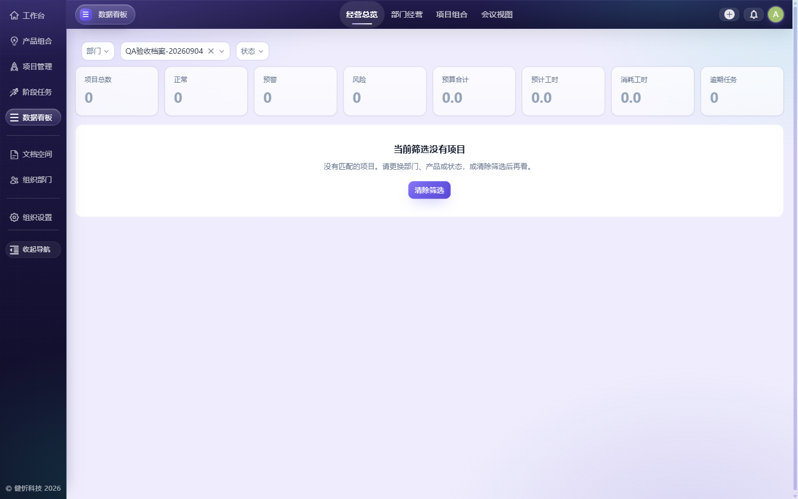

---

## 23. 逾期任务跳转

**预期：** 点击逾期条目进入对应任务详情。

**结果：** 通过。点击「驾驶舱与预算审批闭环」到达 `/task-view-68.html`（TASK#68）。

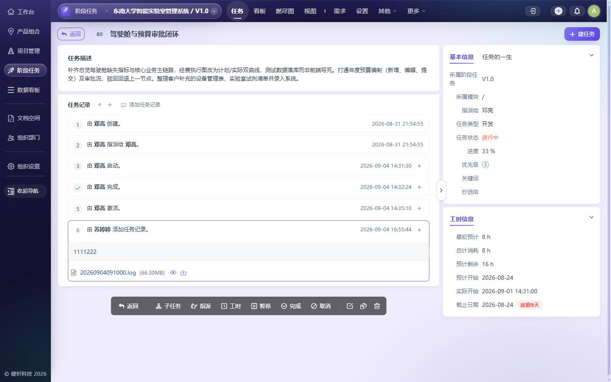

---

## 24. 权限组隐藏已关模块

**预期：** 按模块分配权限中无项目测试 / 执行测试 / 执行构建。

**结果：** 通过。模块列表无上述三项，也无注册 / 准入 / 入院。仍保留禅道「发布」权限包（产品二级菜单已隐藏发布）。

---

## 25. 数据看板权限包

**预期：** `jxboard` 保留浏览类权限。

**结果：** 通过。选中「数据看板」后，权限包为「浏览」，方法含查看看板 / 经营总览 / 部门经营 / 项目组合 / 会议视图。

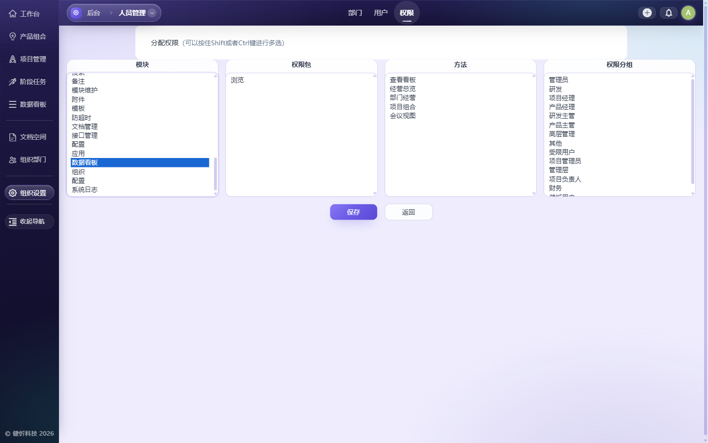

---

## 26. Bug 模块拦截

**预期：** 直链 `/bug-browse.html` 不可用。

**结果：** 通过。弹窗：「无权访问该应用，请检查权限设置。」

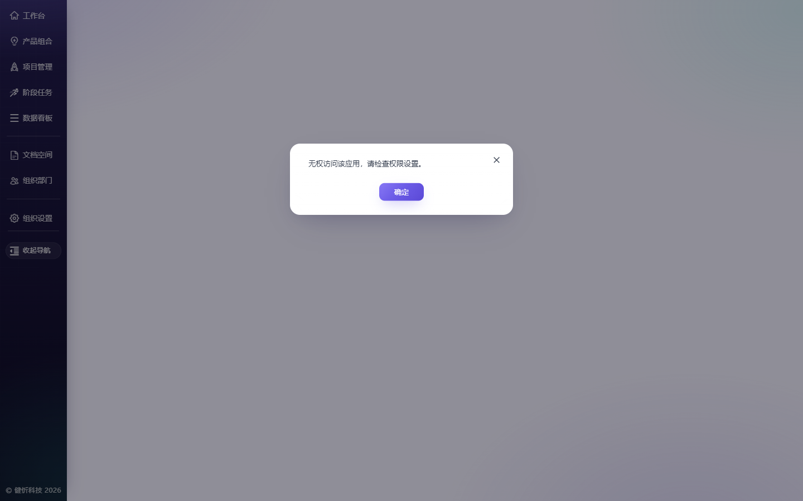

---

## 27. 待处理无「需求」页签

**预期：** 工作台「待处理」三级导航不再出现禅道「我的需求」。

**结果：** 通过。页签仅「任务」；无「需求」。直链 `/my-work-story-assignedTo.html` 仍可排障（与 Bug 页签同一策略）。

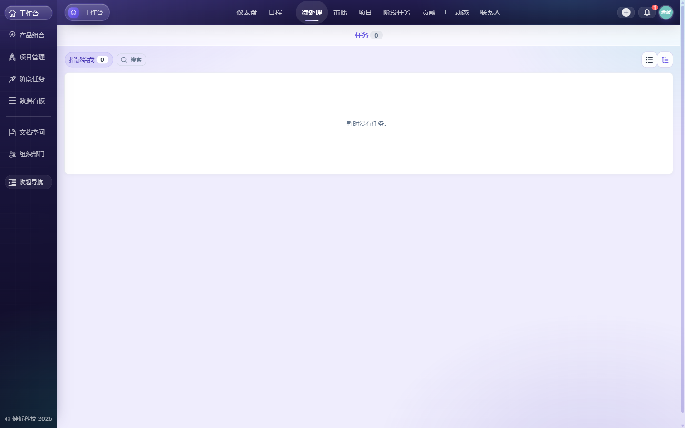

---

## 28. 贡献无「需求」页签

**预期：** 「贡献」二级菜单同步去掉「需求」。

**结果：** 通过。页签为任务 / 审批 / 文档。

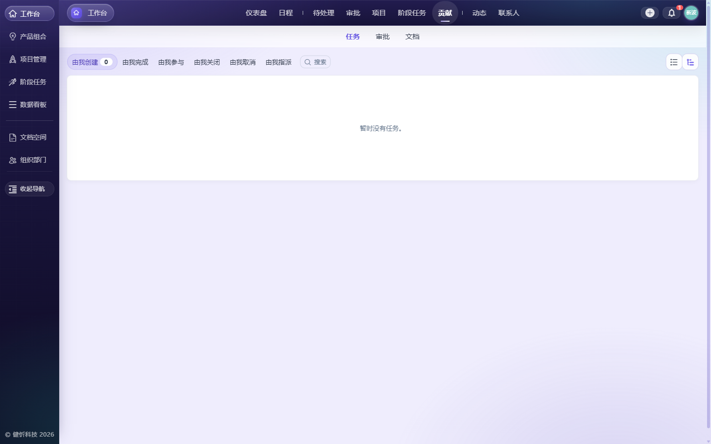

---

## 29. 权限页去掉「发布」

**预期：** 按模块分配权限无「发布」「项目发布」子集；「需求」「产品计划」保留。

**结果：** 通过。模块列为产品 / 产品设置 / 需求 / 产品计划 / 项目计划 / 项目需求 / 项目…，无发布。`application` 包随 release 子集一并去掉。

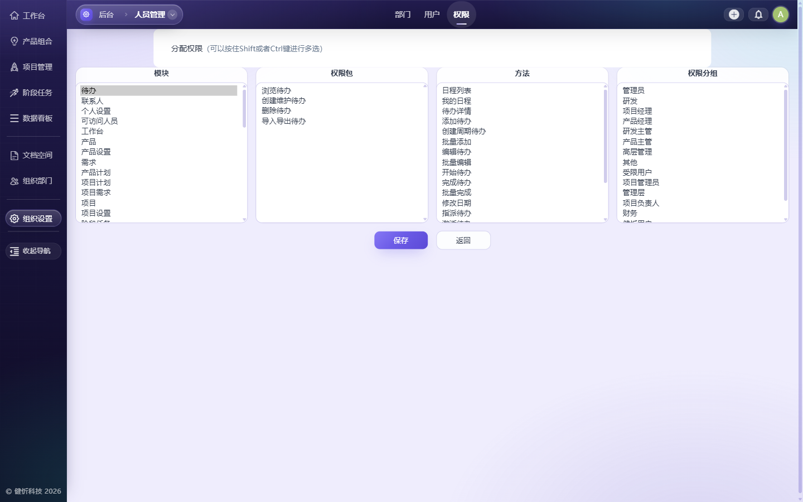

---

## 30. 看板新建无 Bug DOM

**预期：** 新建下拉仍为提需求 / 批量新建需求 / 建任务 / 批量建任务；DOM 无 `#batchCreateBug`。

**结果：** 通过。阶段 36 任务看板新建菜单如上；页面正文与 DOM 均无「批量提Bug」。

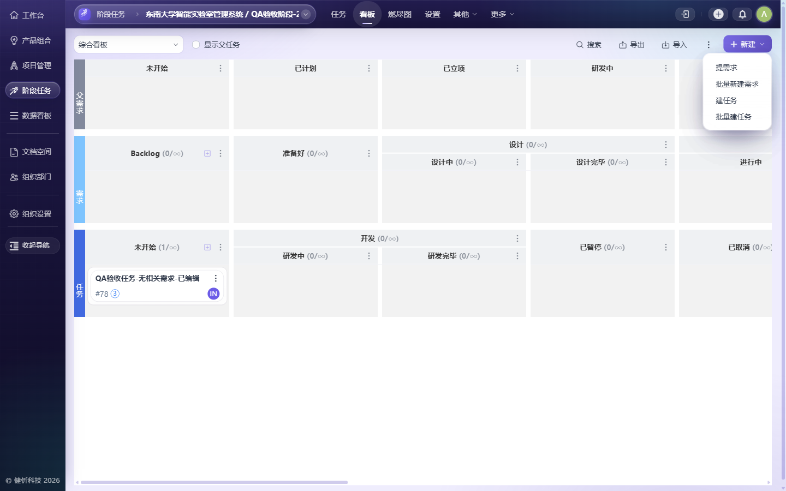

---

## 31. 非管理员产品落地（qa_nostory）

**预期：** 无 `product-browse` 时，产品列表名称落到仪表盘；顶栏无需求；直链 browse 拦截。

**结果：** 通过。本地组 `QA-无需求`、账号 `qa_nostory`。产品 22 名称链接 `/product-dashboard-22.html`，顶栏为仪表盘 / 项目 / 文档 / 动态 / 设置。直链 `/product-browse-22.html` → `/user-deny-product-browse.html`（访问受限）。

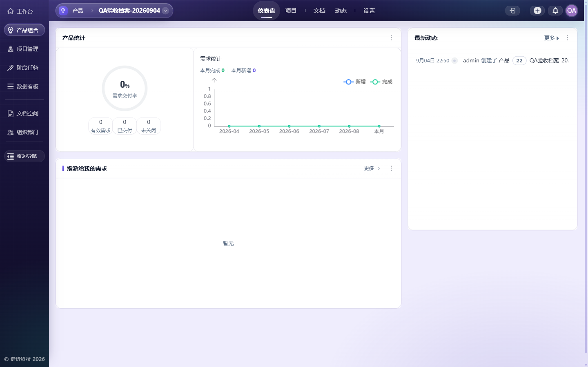

---

## 32. 非管理员项目设置按钮（qa_nostory）

**预期：** 未勾选 `project-team` / `project-group` / `project-whitelist` 时，项目列表操作列无团队 / 权限 / 白名单。

**结果：** 通过。操作列为编辑 / 删除。直链 `project-group-22`、`project-whitelist-22` 落到 `user-deny-*`。按权限分组隐藏，不是按「非 admin」一刀切。

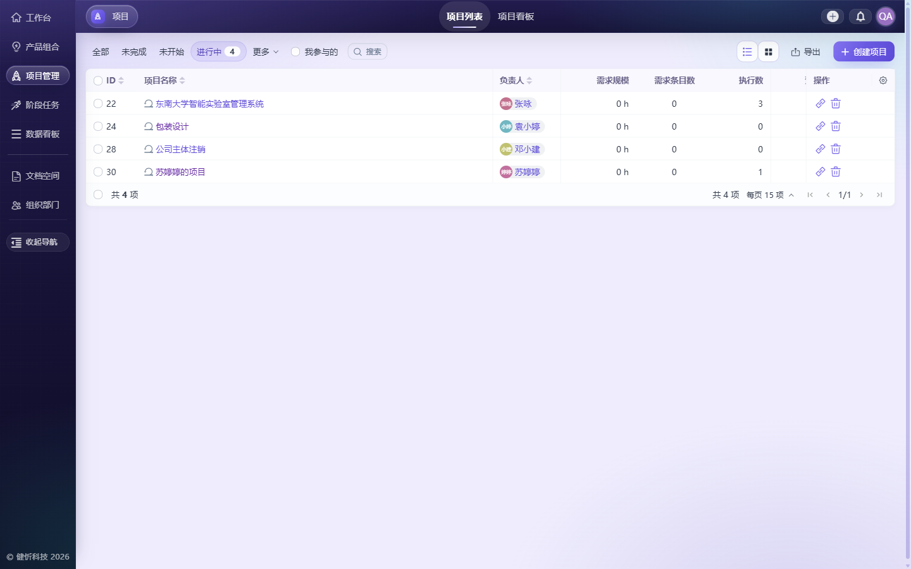

---

## 残留与未覆盖

1. **已收口** 待处理 / 贡献「需求」页签：见第 27、28 条。
2. **已收口** 权限「发布」「项目发布」包：见第 29 条。「浏览需求」「产品计划」权限包保留（看板仍可提需求）。
3. **已收口** 看板 `#batchCreateBug` DOM：见第 30 条。
4. **已收口** 非管理员复测：见第 31、32 条。本地账号 `qa_nostory`、组 `QA-无需求` 可删可留。
5. **按范围不回加** 阶段创建「关联计划」：本轮未改创建表单。现网简洁版添加阶段已无该字段（扩展 `create.html.php` 先前已裁），与 9/4 截图时「仍在」不同，以现网为准。

**明确保留：** 看板「提需求」；权限页「需求」「产品计划」包；管理员直链排障。

