# 健忻医疗项目管理系统 · 用户指导手册

| 项 | 内容 |
| --- | --- |
| 产品 | 健忻医疗项目管理系统 |
| 文档 | 用户指导手册 |
| 版本 | **1.0** |
| 日期 | 2026-09-05 |
| 适用对象 | 业务用户 / 项目成员 |
| 说明 | 按普通业务账号界面编写；组织设置仅管理员可见，本手册不展开后台配置 |

---

## 文档说明

本手册按日常工作顺序，说明当前一期项目管理的完整路径：

**运营平台直达（或登录） → 工作台 → 产品组合 → 创建项目 → 添加阶段 → 建任务并推进 → 数据看板回顾 → 文档归档 → 查看组织同事**

贯穿示例使用现网项目 **「东南大学智能实验室管理系统」**。阅读后文前，先熟悉下面这些界面用语。

| 界面用语 | 含义 |
| --- | --- |
| 产品组合 | 产品列表 + 医疗档案 |
| 产品档案 | 型号、管理类别、注册证、有效期等字段 |
| 阶段任务（一级菜单） | 所有阶段的列表和看板入口 |
| 阶段（项目内） | 一段时间的工作容器 |
| 数据看板 | 经营总览 / 部门经营 / 项目组合 / 会议视图 |
| 组织部门 | 团队与部门视图 |
| 组织设置 | 管理员后台，普通用户通常不可见 |
| 临期 | 证照有效期在 90 天以内 |

组织设置仅管理员可见，本手册不展开后台配置。

---

## 1. 系统概述与登录

### 1.1 你能做什么

登录后，左侧通常可以看到这些入口（管理员还会看到「组织设置」）：

| 菜单 | 用来做什么 |
| --- | --- |
| 工作台 | 看待办、待处理任务、审批、我参与的项目 |
| 产品组合 | 维护产品档案（型号、管理类别、注册证、有效期等） |
| 项目管理 | 创建并管理项目，拆阶段 |
| 阶段任务 | 在阶段里建任务、更新进度、完成任务 |
| 数据看板 | 看项目健康度、逾期任务、部门汇总 |
| 文档空间 | 放产品 / 项目 / 个人文档 |
| 组织部门 | 查看同事、部门归属 |

主路径可以记成：

1. 把产品建档（或确认已有产品）
2. 创建项目并关联产品
3. 在项目下添加阶段
4. 在阶段里建任务、指派、开始、完成
5. 用数据看板看逾期与风险
6. 把过程资料放到文档空间

### 1.2 进入系统

**推荐方式：从健忻数智化运营平台一键直达（免登录）。**

1. 先登录 **健忻数智化运营平台**。
2. 在顶栏最右侧、系统配置旁边，点 **项目管理**。
3. 系统会直接打开项目管理系统并进入工作台，无需再次输入账号。

图 1-1 运营平台顶栏「项目管理」入口

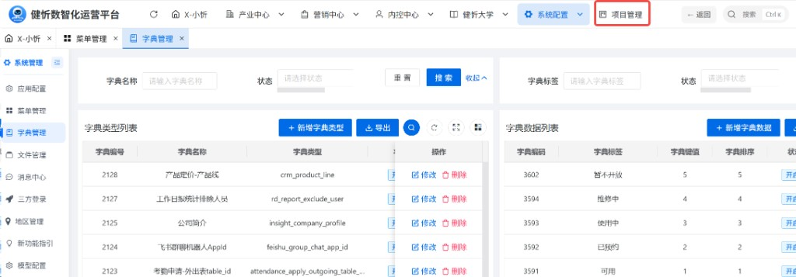

**备选方式：账号登录页。** 若暂时打不开运营平台，可在浏览器打开登录地址 **https://pm.jenshin.cn**，在「欢迎登录」中输入用户名和密码，再点 **登录**。右上角可切换简体中文 / English。

图 1-2 登录页

进入后，右上角会显示你的姓名，左侧是一级导航。

---

## 2. 工作台

### 2.1 目的

每天先看工作台，确认「需关注」和待我处理的事项，再进入具体项目。

### 2.2 入口

登录后默认进入 **工作台**，也可点左侧「工作台」。

图 2-1 工作台与一级导航

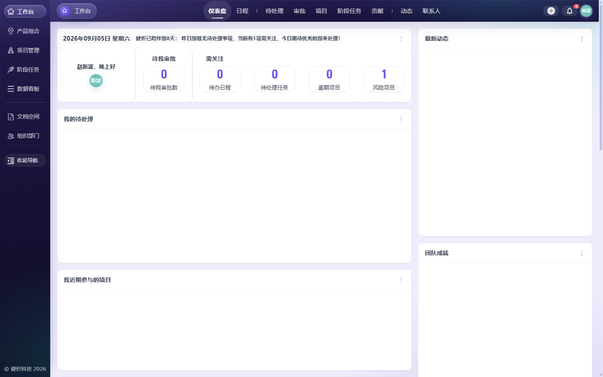

顶栏有：仪表盘、日程、待处理、审批、项目、阶段任务、贡献、动态、联系人。

### 2.3 需关注

欢迎区会显示：

| 数字 | 含义 | 点进去到哪 |
| --- | --- | --- |
| 待办日程 | 今天及未完成的日程 | 日程 |
| 待处理任务 | 指派给你、尚未完成的任务 | 待处理 · 指派给我 |
| 逾期项目 | 按看板口径统计的逾期项目 | 数据看板总览（有权限时） |
| 风险项目 | 健康度为风险的项目 | 数据看板总览 |

数字可以点击。没有事项时显示 0。

### 2.4 待处理任务

1. 点顶栏 **待处理**，或点欢迎区「待处理任务」。
2. 默认看「指派给我」。
3. 列表一般为：ID、任务名称、优先级、状态、所属项目、所属阶段任务、创建者、操作。

图 2-2 待处理任务（指派给我）

若显示「暂时没有任务」，说明当前没有指派给你的未完成任务，可以从「项目管理」或「阶段任务」进入在办项目继续推进。

### 2.5 审批

点顶栏 **审批**。没有待审时显示「暂无」。

图 2-3 审批

---

## 3. 产品组合

### 3.1 目的

先把产品档案建清楚，再挂项目。列表会直接显示医疗档案字段，证照 90 天内到期会标 **临期**。

### 3.2 查看产品列表

1. 点左侧 **产品组合**。
2. 可用「全部产品 / 未关闭 / 结束」筛选，或搜索名称。
3. 点右上角 **添加产品** 可新建（打开表单后按页内必填项填写）。

图 3-1 产品列表（含档案列与临期）

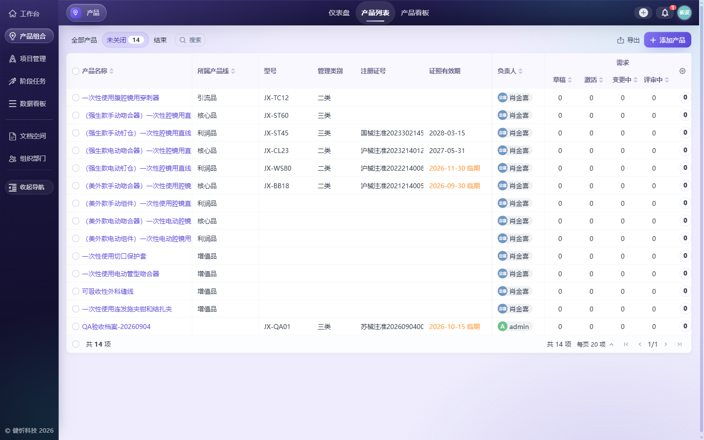

请关注这些列：

- **型号**
- **管理类别**（一类 / 二类 / 三类）
- **注册证号**
- **证照有效期**（90 天内显示橙色「临期」）
- 负责人、关联阶段任务等

### 3.3 查看产品详情

1. 在列表点产品名称（例如「东南大学智能实验室管理系统」）。
2. 进入产品概况 / 仪表盘。
3. 顶栏为：**仪表盘、项目、文档、动态、设置**。

图 3-2 产品概况与档案面板

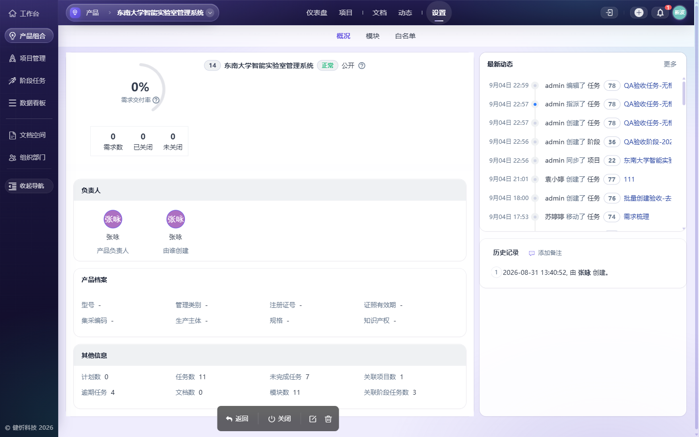

**产品档案** 面板字段：型号、管理类别、注册证号、证照有效期、集采编码、生产主体、规格、知识产权。未填写显示 `-`。

同页还能看到任务数、未完成任务、逾期任务、关联项目数等。

### 3.4 编辑档案

1. 在详情底栏点编辑（铅笔），或从列表进编辑。
2. 修改基础信息和档案字段后保存。
3. 列表勾选多条后点「编辑」，可批量改管理类别、注册证号、证照有效期。

图 3-3 编辑产品（含档案字段）

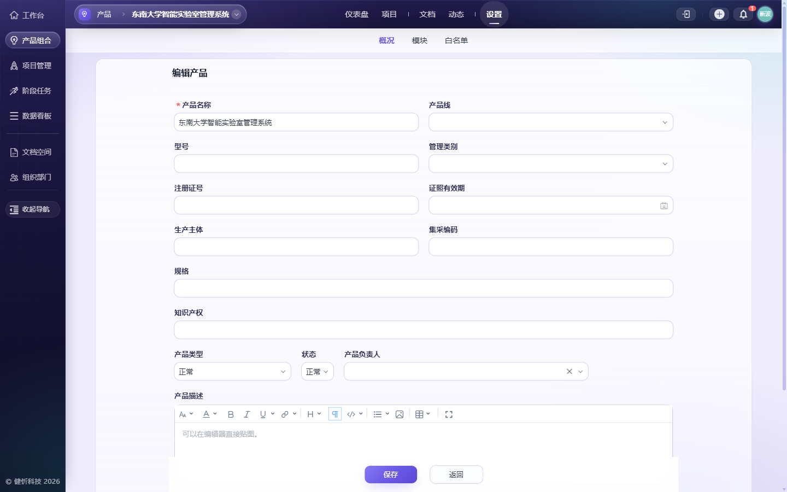

表单中可见：产品名称、产品线、**型号、管理类别、注册证号、证照有效期、生产主体、集采编码、规格、知识产权**。

---

## 4. 项目管理

### 4.1 目的

项目是阶段和任务的容器。在列表中创建项目后，填写名称、负责人、周期并关联产品即可。

### 4.2 查看项目列表

1. 点左侧 **项目管理**。
2. 可用全部 / 未完成 / 未开始 / 进行中等筛选；可打开「我参与的」。
3. 点 **创建项目** 新建；点项目名称进入该项目。

图 4-1 项目列表

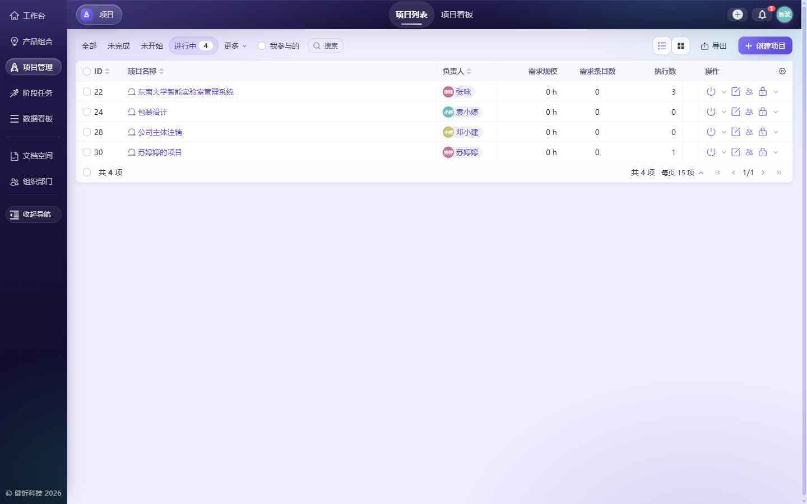

操作列是否出现团队、权限、白名单，取决于你的权限组。普通业务账号以自己能看到的按钮为准。

### 4.3 创建项目

1. 在项目列表点 **创建项目**。
2. 选择 **产品型** 或 **项目型**。
3. 填写项目名称、负责人、计划日期。
4. **关联产品**：尽量选已建档的产品；未选时系统可能自动创建与项目同名的产品。
5. 按需填写描述，点 **保存**。

图 4-2 创建项目

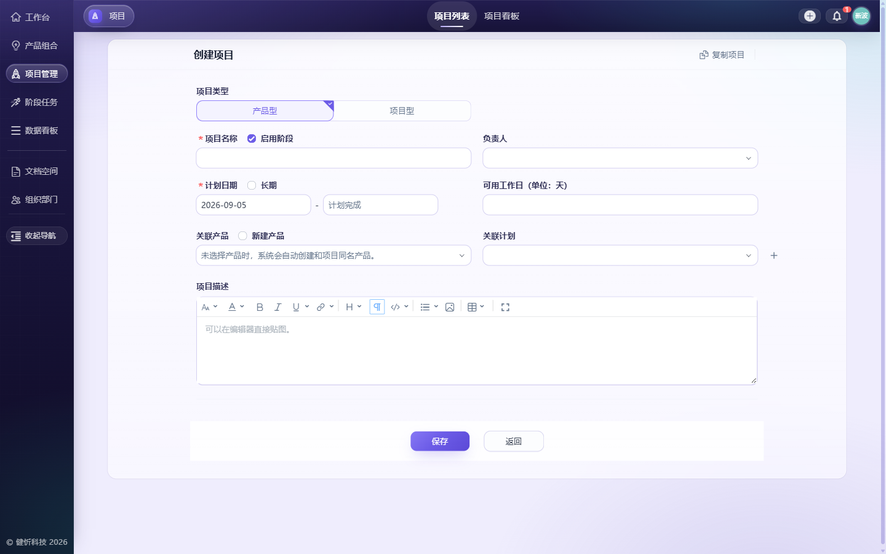

### 4.4 进入项目

以「东南大学智能实验室管理系统」为例：在列表点名称，进入项目仪表盘。

图 4-3 项目仪表盘

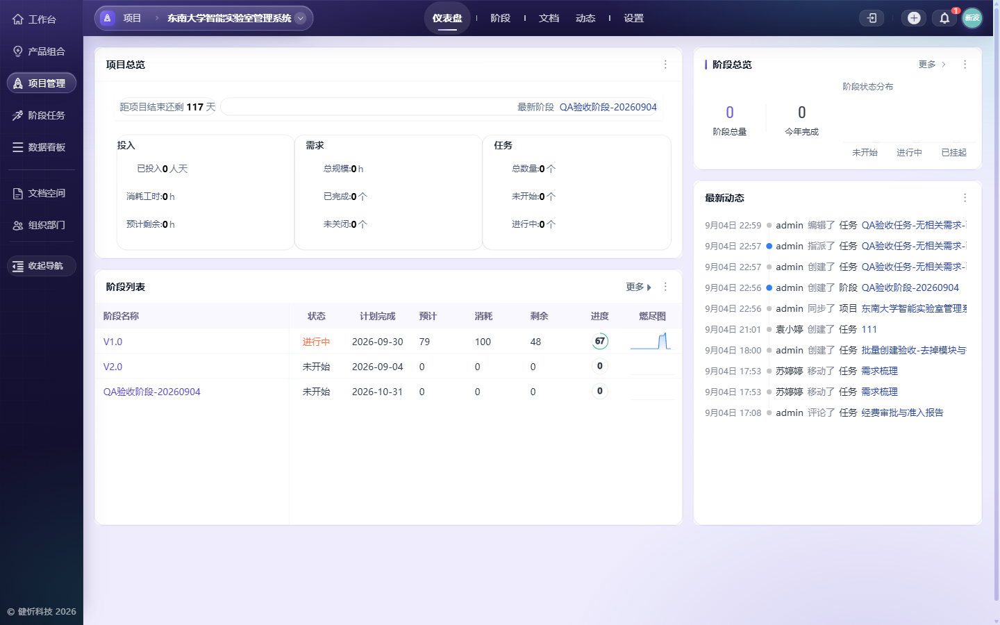

项目顶栏常见为：**仪表盘、阶段、文档、动态、设置**。仪表盘可看距结束天数、最新阶段、投入、任务数量和阶段总览。

### 4.5 添加阶段

1. 在项目里点 **阶段**，或到一级菜单 **阶段任务** 点 **添加阶段**。
2. 确认 **所属项目**。
3. 填写阶段名称；类型选短期 / 长期 / 运维。
4. 填写计划起止日期。
5. 点 **保存**。

图 4-4 添加阶段

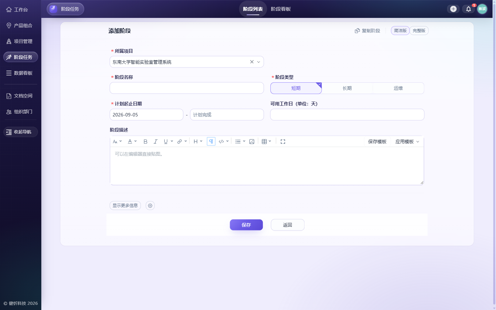

---

## 5. 阶段任务

### 5.1 目的

阶段是一段时间的工作容器。日常在阶段的任务列表里创建、指派、开始和完成任务。

### 5.2 阶段列表

1. 点左侧 **阶段任务**。
2. 顶栏可切 **阶段列表** / **阶段看板**。
3. 列表显示阶段名称、所属项目、状态、负责人、计划日期和进度。
4. 点阶段名称（如 **V1.0**）进入该阶段。

图 5-1 阶段列表

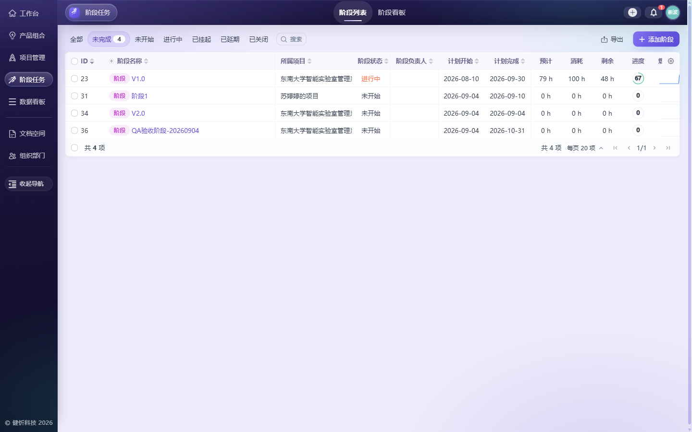

### 5.3 阶段内任务列表

进入阶段后，顶栏常见为：任务、燃尽图、视图、文档、动态、设置。

图 5-2 阶段 V1.0 任务列表

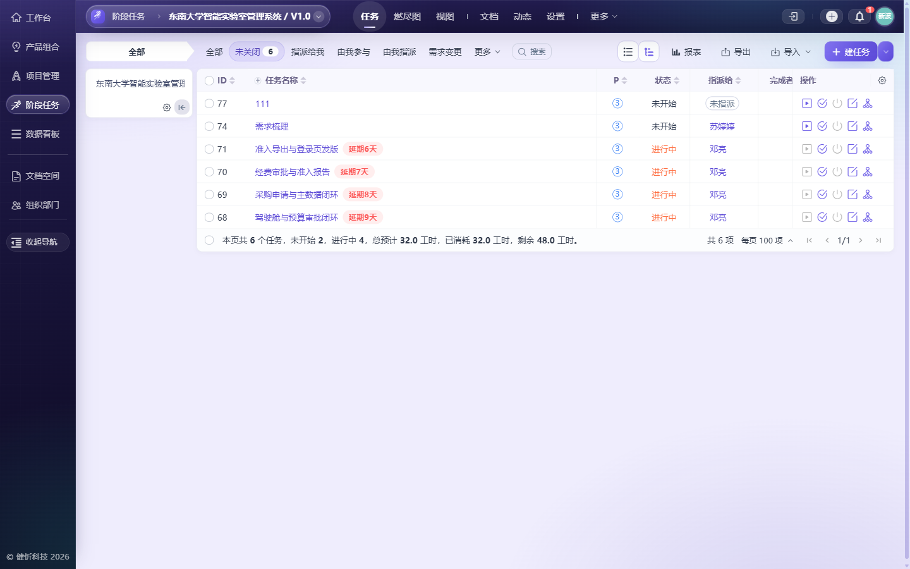

可以：

- 按「全部 / 未关闭 / 指派给我 / 由我参与」筛选
- 点 **建任务** 或 **导入**
- 在行内点 **开始**、**完成**、编辑

任务列包括：ID、任务名称、优先级、状态、指派给、完成者、截止日期、工时等。

### 5.4 建任务

1. 在阶段任务列表点 **建任务**。
2. 可先用「简洁版」，需要更多字段再切「完整版」。
3. 确认所属阶段；填写任务类型、指派给、任务名称、优先级、预计工时、描述。
4. 点 **保存**。

图 5-3 建任务表单

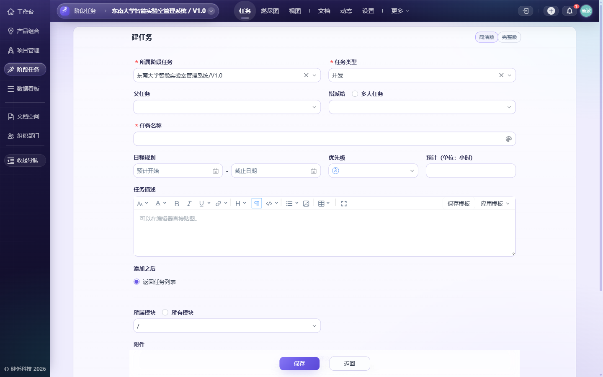

### 5.5 查看与完成任务

1. 在列表点任务名称，例如「驾驶舱与预算审批闭环」。
2. 详情里看阶段、指派、类型、状态、进度、优先级和任务描述。
3. 开始处理时点 **开始** 并填写消耗 / 剩余。
4. 做完后点 **完成**，在弹窗里填写本次消耗、实际起止时间和备注（任务记录），再点弹窗中的 **完成**。

图 5-4 完成任务

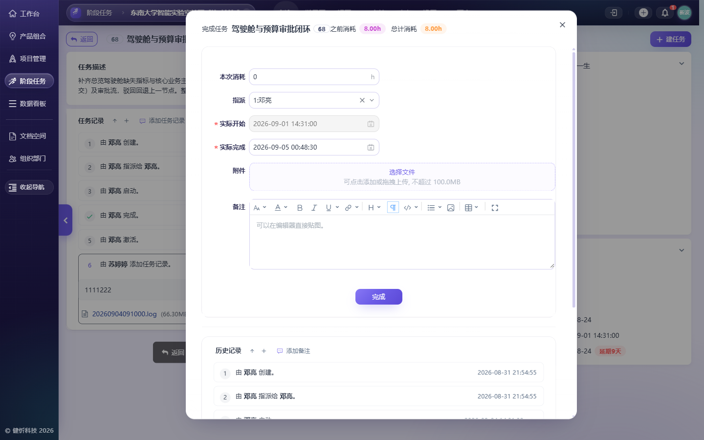

---

## 6. 数据看板

### 6.1 目的

晨会、周会或自己复盘时，用四视图看整体健康度，再点回任务处理。需要权限组勾选「数据看板 · 浏览」。

### 6.2 经营总览

点左侧 **数据看板**。可按部门、产品、状态筛选。

图 6-1 经营总览

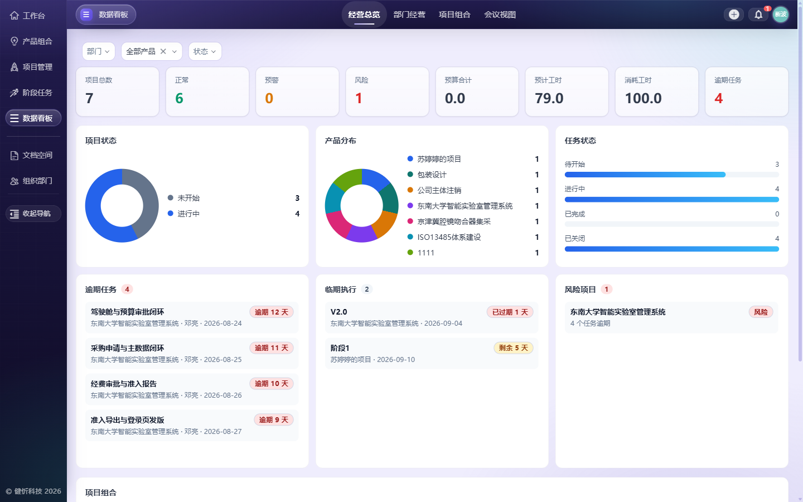

顶部 KPI 包括：项目总数、正常 / 预警 / 风险、预算合计、预计 / 消耗工时、**逾期任务**。下方有项目状态、产品分布、风险项目等。没有数据时用「清除筛选」重置。

### 6.3 逾期与临期

总览和会议视图都会列出逾期任务。点条目可进入对应任务。

图 6-2 会议视图中的逾期任务

### 6.4 部门经营

点顶栏 **部门经营**，按部门看项目数、工时、逾期、风险。未分配部门的项目会计入「未分配」，请在组织部门维护负责人所属部门。

图 6-3 部门经营

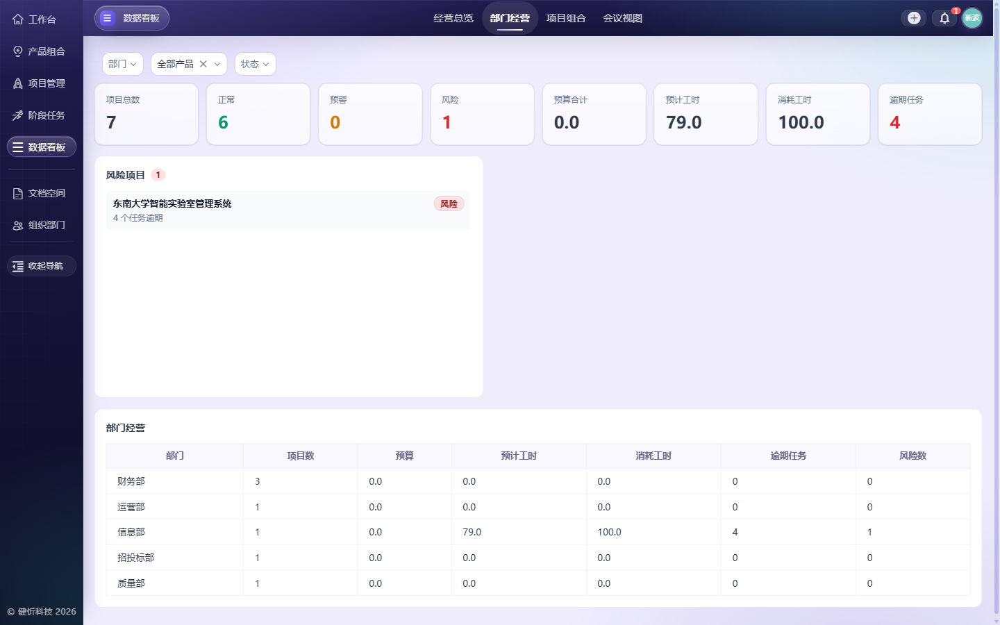

### 6.5 项目组合

点 **项目组合**。表格含健康度（正常 / 预警 / 风险）、进度、任务、工时、预算、完成日。

图 6-4 项目组合

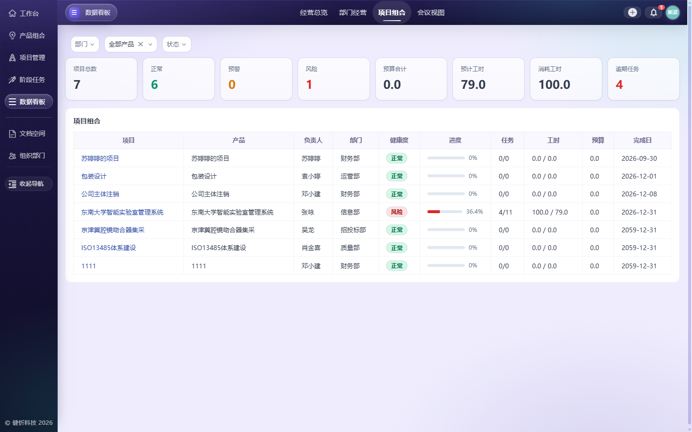

### 6.6 会议视图

点 **会议视图**，同时列出逾期任务和临期阶段，适合会前投影。

图 6-5 会议视图

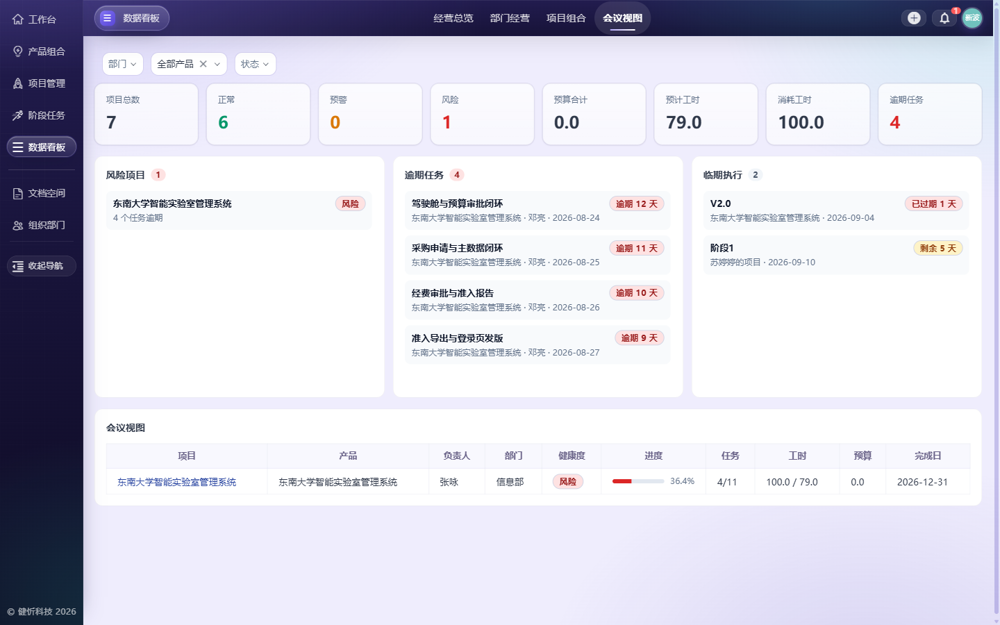

---

## 7. 文档空间

### 7.1 目的

把方案、会议纪要、过程资料放到统一空间，避免只存在个人电脑。

### 7.2 入口

- 左侧 **文档空间**
- 产品 / 项目 / 阶段顶栏里的 **文档**

图 7-1 文档空间首页

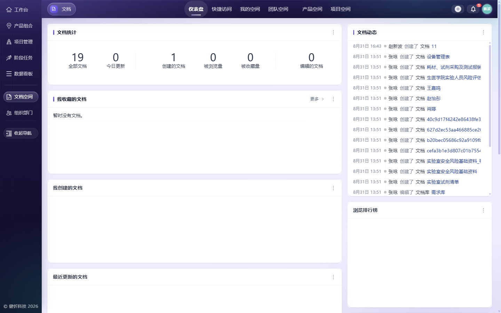

顶栏常见：仪表盘、快捷访问、我的空间、团队空间、产品空间、项目空间。首页有文档统计和文档动态。在对应空间新建文档库或文档即可。

---

## 8. 组织部门

### 8.1 目的

查看同事、部门归属。数据看板按部门汇总时，依赖这里的部门信息。

### 8.2 查看团队

点左侧 **组织部门**，打开团队列表。

图 8-1 组织部门（团队）

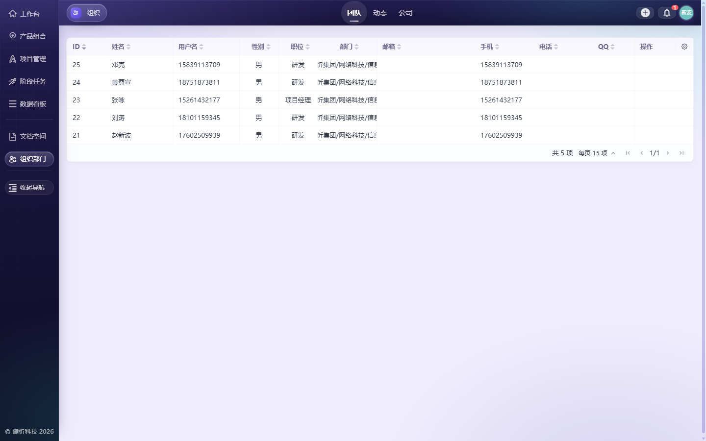

列表含姓名、用户名、职位、部门、联系方式等。部门路径示例：`健忻集团 / 网络科技 / 信息部`。

**组织设置**（部门增删、账号开通、权限分组）由管理员在后台维护。普通账号看不到该菜单时，把人员和权限事项告诉管理员即可。

右上角姓名可进入个人资料、修改密码等，以你账号实际菜单为准。

图 8-2 登录后右上角身份

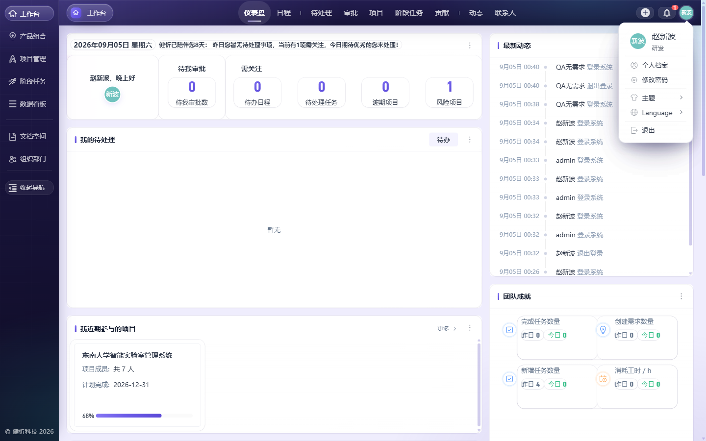

---

## 附录 A 权限与常见问题

**「健忻用户」一类业务权限通常可以：** 浏览并维护产品、创建/编辑项目与阶段、创建/完成任务、浏览数据看板四视图、使用文档空间。具体以你被分配的权限组为准。

**常见问题**

1. **提示无权访问**  
   请联系管理员检查账号权限或权限分组。

2. **点产品名称进到哪一页？**  
   进入该产品的概况 / 仪表盘。

3. **证照「临期」怎么算？**  
   有效期距今天 90 天以内。过期后仍应尽快更新档案。

4. **数据看板菜单在，但进不去**  
   请管理员在权限分组中勾选「数据看板」的浏览（总览 / 部门 / 组合 / 会议）。

---

## 附录 B 版本记录

| 版本 | 日期 | 说明 |
| --- | --- | --- |
| 1.0 | 2026-09-05 | 首版。覆盖现网一期项目管理主路径。 |
